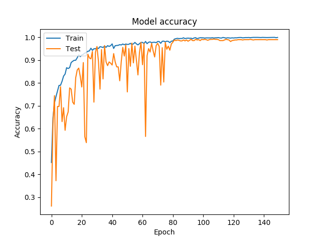

# classify.keras

> 用于PRCV2019-大田作物病害图像识别技术挑战赛 

## 1. 思路-集成学习

根据集成学习的思路，组合这里的多个弱监督模型以期得到一个更好更全面的强监督模型，集成学习潜在的思想是即便某一个弱分类器得到了错误的预测，其他的弱分类器也可以将错误纠正回来。

简单运用这个想法，我们将多个训练出的分类器进行投票，对投票得分高的结果作为最终结果。

在本库中，我们选择了五个模型作为基本弱监督模型，集成为一个模型。

- 手工实现的resnet
- 官方提供的ResNet50
- Inception_v3
- InceptionResNetv2
- Xception

## 2. 观测指标

F1-score: 作为precision和recall两个指标的平衡，具有较好的可信性。

Loss：计算结果与真实结果之间的差距

accuracy: 准确率

val_accuracy: 测试集准确率

Tensorboard: 结果记录在logs文件夹中

## 3. 训练参数介绍

--resume : 是否恢复训练，如果选择该选项，需要写读取模型的位置

--model-path: 恢复训练所需要模型存放地址

--epoch: 设置循环次数

--init: 设置当前从第几个神经元开始运行

--bs: 设置batch size 的大小

## 4. 数据要求

要求图片需要按照以下格式进行整理，其中class1代表该文件夹中全部是class1类别的图片。

```
- data
	- train
		- class1
		- class2
		- class3
		- ...
		- class6
	- validation
		- class1
		- class2
		- class3
		- ...
		- class6
```


## 4. 训练细节

### 4.1 数据增强

- 离线增强
    - 由于每个类别内部数据并不平衡，采用了“过采样”的方法，对数据不够的图片进行过采样。
- 在线增强
    - 使用keras中ImageDataGenerator方法进行在线增强，使用了以下方法：
        - shear：剪切
        - zoom：随机放缩
        - horizontal_flip: 横向翻转
        - vertical_flip: 纵向翻转
        - zca_whitening
        - rotation_range: 180
        - width_shift_range: 0.1
        - height_shift_range: 0.1

### 4.2 训练trick

learning_rate reduce: 使用的是阶段式下降的方法

loss计算采用：categorical_crossentropy

optimizer: 采用的默认的adam优化器



## 5. 使用说明

### 5.1 训练

main.py是主要的训练代码，先将图片按照以上说明整理好，然后只需指派训练的模型，保存模型的名称，epoch个数等。就可以进行训练，训练的时候可以通过tensorboard查看训练实时效果，训练的权重保存在checkpoint文件夹中。

### 5.2 测试

test.py是测试代码，可以计算整体precision，只需要改动待测权重和待测试图片路径即可。

最终会计算precision, 并将所有错误图片名称保存在errorlist.txt文件中。

### 5.3 结果

首先将测试集解压在主文件夹下，然后分别运行fuza.py， jiandan.py, danyi.py三个文件夹，然后分别获得fuza.json， jiandan.json, danyi.json三个文件。

测试集结果提交格式要求：对测试集每幅图像，对其所属的病害种类进行图像识别，提交结果应存为JSON文件，提交结果应包含测试样本id（即文件名）与所属的病害分类id，文件中每一个大括号内的数据是一张测试样本的识别结果，示例如下：

```
[ { "image_id": "prcv2019test05213.jpg", "disease_class":1 }, ...]
```

